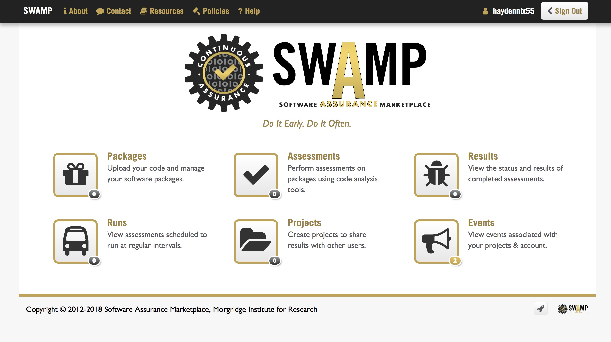

# Homework 3
#### 2/28/17

   1. What I Planned On Doing
   
      For this checkpoint I would like to have all the different technologies setup and working together, as well as some basic classes written for testing. A difficult part of this assignment for me will be learning the new technologies and integrating them together. If I can set up my repo, CI, testing framework, GUI editor, and the file structure itself to work well, I will be well prepared to attack this project. I will have a repo created in Github with TravisCI setup to compile, build, and run a test file. This will also mean I will have some basic functions written in order to set up Catch and have some tests for Travis to run. I will have integrated with my code with the FLTK library, and have a menu GUI completed. Lastly, I will have YASCA installed locally to run static analysis on my code.
      
   2. What I Actually Accomplished
   
      I was able to get all the different technologies set up. 
      * I created my repo with an organized file structure, and a fairly intense Makefile that allows for making the project ( and storing the object files ), making the test suite, and cleaning.
      * I downloaded the Catch header file and set up a test file. I used it to run some initial "tests of the tests", but didn't push them to version control. I implemented enums Suit and Value and struct Card, and a test to show that Catch (and Travis are working)
      * I set up Travis-CI to build the project on Mac OSX and Linux, and run the test suite. This runs whenever there is a push to any branch, and will notify me of failing builds or test suites by phone and email.
      * I downloaded Qt Creator, and have made a menu page with buttons to link to the three main functionalities.
         * I didn't integrate the Qt code with my source code file structure. I found the Qt Creator IDE a little cluttered, so I'll be developing the source code seperately and integrating them together. Instead, I put the GUI directory in the repo (chicken_dinner_gui).
         * I am using Qt rather than FLTK. This is because this is the tool we will be using in class, and the IDE Qt Creator adds abstraction over the tedium of GUI development.
      * I created a SWAMP account, which is a free cybersecurity tool for testing code with multiple tools.
         * We talked about this in my cybersecurity class and how no security framework is comprehensive, so I chose SWAMP over YASCA. The SWAMP allows you to run multiple frameworks and get a summary of vulnerabilities.
      
   3. Next Deadline
        
        a. What I Had Planned
        
        * I would like to have all the game functionality of blackjack working. This would be any part of the code that would be required to play a game if this was an application to do so. It (the program) should be able to play rounds (without strategy).
         
        b. Changes
        
        * I don't currently forsee any changes other than that I will be using Qt and SWAMP rather than FLTK and YASCA.
        
   4. Screenshots
      
      Travis Build History Page:
      
      
      Swamp Homepage:
      
      
      Initial GUI via Qt:
      
           
   
          
